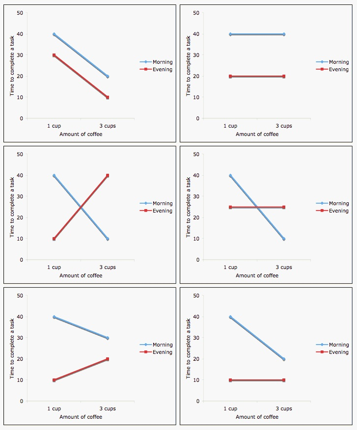

Outline - session 1
========================================================

* multiple regression terminology and notation
    + continuous & categorical predictors
    + interactions
    + ANOVA tables
    + Model formulae

Multiple Linear Regression Model (sec. 4.2)
========================================================
Systematic part of model:

$$
E[y|x] = \beta_0 + \beta_1 x_1 + \beta_2 x_2 + ... + \beta_p x_p
$$

- $E[y|x]$ is the expected value of $y$ given $x$
- $y$ is the outcome, response, or dependent variable
- $x$ is the vector of predictors / independent variables 
- $x_p$ are the individual predictors or independent variables
- $\beta_p$ are the regression coefficients

Multiple Linear Regression Model (cont'd)
========================================================
Random part of model:

$y_i = E[y_i|x_i] + \epsilon_i$

$y_i = \beta_0 + \beta_1 x_{1i} + \beta_2 x_{2i} + ... + \beta_p x_{pi} + \epsilon_i$

- $x_{ji}$ is the value of predictor $x_j$ for observation $i$

Assumption: $\epsilon_i \stackrel{iid}{\sim} N(0, \sigma_\epsilon^2)$

* Normal distribution
* Mean zero at every value of predictors
* Constant variance at every value of predictors
* Values that are statistically independent

Continuous predictors
========================================================
* **Coding:** as-is, or may be scaled to unit variance (which results in _adjusted_ regression coefficients)
* **Interpretation for linear regression:** An increase of one unit of the predictor results in this much difference in the continuous outcome variable
    + *additive model*

Binary predictors (2 levels)
========================================================
* **Coding:** indicator or dummy variable (0-1 coding)
* **Interpretation for linear regression:** the increase or decrease in average outcome levels in the group coded “1”, compared to the reference category (“0”)
   + _e.g._ $E(y|x) = \beta_0 + \beta_1 x$ 
   + where x={ 1 if male, 0 if female }

Multilevel Categorical Predictors (Ordinal or Nominal)
========================================================
* **Coding:** $K-1$ dummy variables for $K$-level categorical variables *
* **Interpretation for linear regression:** as above, the comparisons are done with respect to the reference category
* Testing significance of multilevel categorical predictor: partial F-test, a.k.a. nested ANOVA

\small
&#42; STATA and R code dummy variables automatically, behind-the-scenes

Inference from multiple linear regression
=========================================

* Coefficients are t-distributed when assumptions are correct
* Variance in the estimates of each coefficient can be calculated
* The t-test of the null hypothesis $H_0: \beta_1 = 0$ and from confidence intervals tests whether $x_1$ predicts $y$, *holding other predictors constant*
    + often used in causal inference to control for confounding: see section 4.4
    
Interaction (effect modification)
========================================================
Interaction is modeled as the product of two covariates:
$$
E[y|x] = \beta_0 + \beta_1 x_1 + \beta_2 x_2 + \beta_{12} x_1*x_2
$$


Interaction (effect modification)
========================================================


  
Image credit: http://personal.stevens.edu/~ysakamot/

ANOVA table
========================================================

Source of Variation | Sum Sq | Deg Fr | Mean Sq | F  
------------------- | ------ | -- | ------- | --  
Model | MSS | k | MSS/k | (MSS/k)/MSE  
Residual | RSS | n-(k-1) | RSS/(n-k-1) |  
Total | TSS | n-1 | |   

* $k$ = Model degrees of freedom = coefficients - 1
* $n$ = Number of observations
* **F** is F-distributed with $k$ numerator and $n-(k-1)$ denominator degrees of freedom

Regression in R: model formulae
========================================================

[Model formulae tutorial](http://ww2.coastal.edu/kingw/statistics/R-tutorials/formulae.html)

* regression functions in R such as `aov()`, `lm()`, `glm()`, and `coxph()` use a "model formula" interface.
* The formula determines the model that will be built (and tested) by the R procedure. The basic format is:

> response variable ~ explanatory variables

* The tilde means "is modeled by" or "is modeled as a function of." 

Model formulae (cont'd)
========================================================

Model formula for simple linear regression: 

> y ~ x

* where "x" is the explanatory (independent) variable
* "y" is the response (dependent) variable. 

Model formulae (cont'd)
========================================================

Additional explanatory variables would be added as follows: 

> y ~ x + z

Note that "+" does not have its usual meaning, which would be achieved by:

> y ~ I(x + z)

Types of standard linear models
========================================================

```
lm( y ~ u + v)
```
`u` and `v` factors: **ANOVA**  
`u` and `v` numeric: **multiple regression**  
one factor, one numeric: **ANCOVA**

Model formulae (cont'd)
========================================================

symbol  | example | meaning  
------- | ------- | --------  
+ | + x	| include this variable  
-	| - x	| delete this variable  
:	| x : z	| include the interaction  
*	| x * z	| include these variables and their interactions  
/	| x / z	| nesting: include z nested within x  
&#124;	| x &#124; z	| conditioning: include x given z  
^	| (u + v + w)^3	| include these variables and 
&nbsp;  | &nbsp; | all interactions up to three way  
1 | -1 | intercept: delete the intercept  

Model formulae (cont'd)
========================================================

How to interpret the following model formulae?

y ~ u + v + w + u:v + u:w + v:w  
y ~ u * v * w - u:v:w  
y ~ (u + v + w)^2  

Model formulae (cont'd)
========================================================

How to interpret the following model formulae?

> y ~ u + v + w + u:v + u:w + v:w + u:v:w  
> y ~ u * v * w  
> y ~ (u + v + w)^3  

